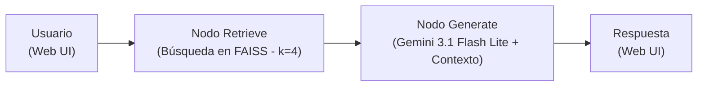
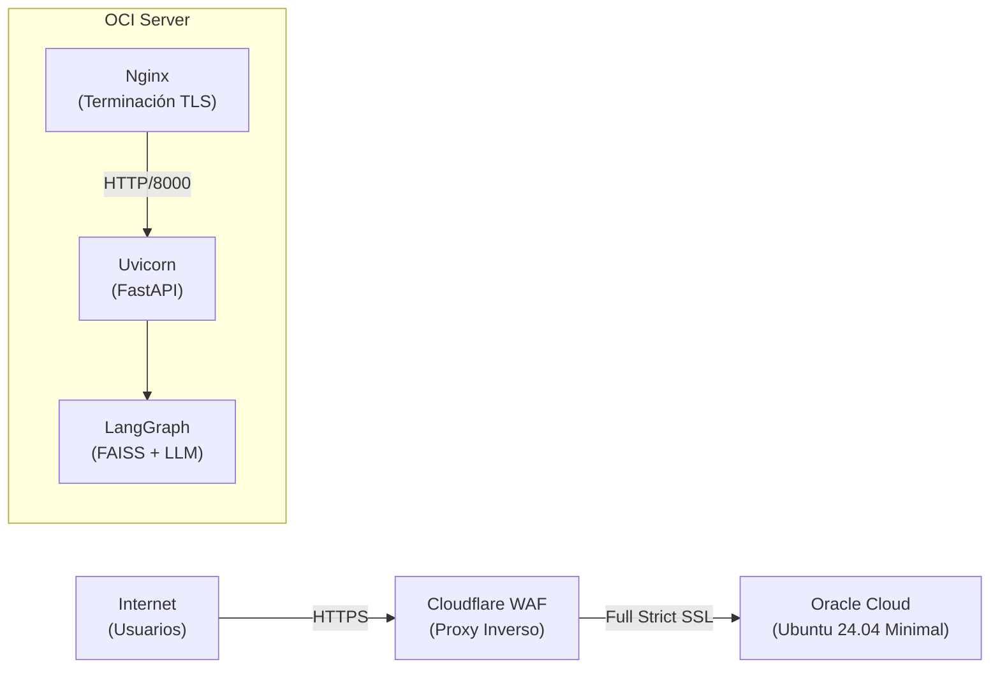

<div align="center">

# GamaSupra Policy RAG Assistant

**Sistema RAG (Retrieval-Augmented Generation) simple y robusto implementado con LangGraph para responder consultas sobre políticas de e-commerce.**

[](https://www.python.org/)
[](https://www.langchain.com/langgraph)
[](https://ai.google.dev/)
[](https://www.voyageai.com/)
[](https://github.com/facebookresearch/faiss)
[](https://fastapi.tiangolo.com/)

---

**Demo en vivo:** [https://gzvz.pp.ua](https://gzvz.pp.ua)

</div>

## Descripción del Proyecto

Este proyecto es un asistente RAG ligero y funcional diseñado para resolver dudas de clientes sobre las políticas de un e-commerce (*GamaSupra*). Permite procesar múltiples formatos de documentos de origen (PDF, DOCX, HTML y Markdown), extraer su contenido semántico mediante **Docling**, indexarlos en **FAISS** con embeddings de alta calidad de **Voyage AI (`voyage-4`)**, y generar respuestas precisas sin alucinaciones utilizando **Gemini 3.1 Flash Lite** coordinado a través de **LangGraph**.

La interacción se realiza a través de una interfaz web conversacional servida mediante una API REST en **FastAPI**.

---

## Arquitectura del Sistema

### 1. Grafo RAG (Lógica Interna)

El sistema utiliza un flujo lineal de 2 nodos dentro de un grafo de estado gestionado por LangGraph:



### 2. Infraestructura de Producción (Modelo Búnker)

El sistema está desplegado en Oracle Cloud Infrastructure (OCI) utilizando una arquitectura de alta seguridad:



---

## Stack Tecnológico

| Componente | Tecnología | Descripción |
| :--- | :--- | :--- |
| **Orquestación RAG** | [LangGraph](https://www.langchain.com/langgraph) | Construcción del grafo determinista (`START → retrieve → generate → END`). |
| **Backend / API** | [FastAPI](https://fastapi.tiangolo.com/) | Servidor web asíncrono para exponer la interfaz de chat y la API. |
| **Frontend** | Vanilla JS / CSS | Interfaz estática modularizada altamente optimizada y segura contra XSS. |
| **LLM** | [Gemini 3.1 Flash Lite](https://ai.google.dev/) | Inferencia de respuestas concisas y profesionales en español. |
| **Embeddings** | [Voyage AI `voyage-4`](https://www.voyageai.com/) | Representación vectorial multilingüe de máxima precisión (1024 dims). |
| **Vector Store** | [FAISS](https://github.com/facebookresearch/faiss) | Almacenamiento e índice vectorial local de alta velocidad. |
| **Seguridad de Red** | [Cloudflare](https://www.cloudflare.com/) | WAF, proxy inverso y cifrado Full Strict (Origin Certificates). |

---

## Estructura del Proyecto

```
raggraph/
├── data/
│   ├── policies/                    # Documentos fuente de políticas (PDF, DOCX, HTML, MD)
│   └── faiss_index/                 # Índice vectorial generado localmente por FAISS
├── scripts/
│   └── index_policies.py            # Script para procesar e indexar las políticas
├── src/
│   ├── api.py                       # Servidor FastAPI principal
│   ├── config.py                    # Configuración centralizada de variables y paths
│   ├── graph.py                     # Definición y compilación del grafo LangGraph
│   └── utils/
│       ├── nodes.py                 # Lógica de los nodos 'retrieve' y 'generate'
│       ├── state.py                 # Definición del TypedDict de estado del grafo
│       └── tools.py                 # Inicializador de embeddings y retriever de FAISS
├── static/
│   ├── index.html                   # Interfaz de usuario (Chat)
│   ├── css/style.css                # Estilos visuales de la interfaz
│   └── js/script.js                 # Lógica asíncrona del cliente
├── .env                             # Variables de entorno y API Keys (git-ignored)
└── requirements.txt                 # Dependencias Python del proyecto
```

---

## Interfaz de Usuario

La aplicación cuenta con una interfaz web dedicada (`static/index.html`) que se sirve estáticamente a través de FastAPI. Esta interfaz simula un entorno de chat profesional que incluye:
- Historial continuo de la conversación.
- Visualización dinámica de fuentes citadas por el LLM.
- Prevención activa de inyecciones XSS en el renderizado de respuestas.

---

## Instalación y Desarrollo Local

### 1. Clonar el repositorio y configurar entorno

```bash
git clone https://github.com/tu-usuario/raggraph.git
cd raggraph
python3 -m venv .venv
source .venv/bin/activate
pip install -r requirements.txt
```

### 2. Configurar variables de entorno

Crea el archivo `.env` en la raíz del proyecto agregando tus credenciales:

```env
GOOGLE_API_KEY="tu_google_api_key_aqui"
VOYAGE_API_KEY="tu_voyage_api_key_aqui"
```

### 3. Indexar Documentos

Ejecuta el script de ingestión para procesar las políticas ubicadas en `data/policies/` y generar el índice FAISS:

```bash
python scripts/index_policies.py
```

### 4. Iniciar el Servidor Web

Inicia el servidor asíncrono Uvicorn:

```bash
uvicorn src.api:app --reload --host 127.0.0.1 --port 8000
```
Accede a `http://127.0.0.1:8000` en tu navegador para interactuar con la interfaz.

---

## Despliegue en OCI (Oracle Cloud)

El proyecto está optimizado para instancias de bajos recursos (ej. OCI VM.Standard.E2.1.Micro - 1GB RAM) utilizando la siguiente metodología:

1. **Eficiencia en Memoria**: Activación obligatoria de Swap (4GB) para compensar los picos de memoria durante la carga inicial de FAISS y Uvicorn.
2. **Filtrado de Tráfico (Cloudflare)**: Los dominios apuntan a Cloudflare para absorber ataques DDoS y filtrado de bots.
3. **Restricción de Origen (UFW)**: El firewall del servidor (`ufw`) está configurado para rechazar cualquier conexión web que no provenga de los rangos de IP oficiales de Cloudflare, asegurando que el proxy inverso no pueda ser evadido.
4. **Persistencia**: La aplicación se ejecuta como un demonio del sistema mediante `systemd`.

---

## Reglas de Comportamiento del Bot

- **Respuesta Estricta por Contexto**: El modelo responde únicamente basándose en la información recuperada de los documentos indexados.
- **Transparencia**: El sistema devuelve las citas exactas de los documentos utilizados para formular la respuesta.
- **Idioma**: Respuestas estructuradas exclusivamente en español profesional.

---

## Licencia

Este proyecto se distribuye bajo la licencia **MIT**. Consulta el archivo `LICENSE` para obtener más detalles.
